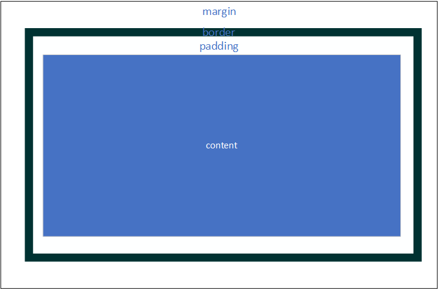
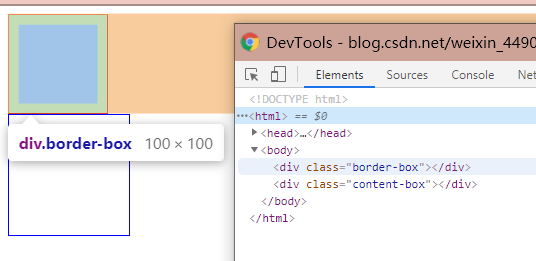
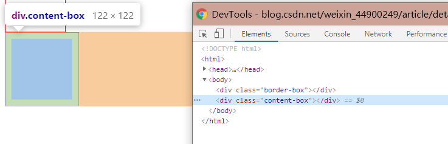

# css

1. 请简述css盒模型

 ```markdown
   所有HTML元素可以看作盒子，在CSS中，"box model"这一术语是用来设计和布局时使用。

   CSS盒模型本质上是一个盒子，封装周围的HTML元素，它包括：边距，边框，填充，和实际内容。

   盒模型允许我们在其它元素和周围元素边框之间的空间放置元素。

  下面的图片说明了盒子模型(Box Model)：
```



```markdown
通过css的box-sizing属性可以指定不同的盒子模型，分为标准盒子模型(content-box)和ie盒子模型(border-box),可以理解为指定的width或height从哪部分开始包含。
```





```html
<!doctype html>
<html>
  <head>
    <title>测试盒模型</title>
    <meta charset="utf-8"/>
  </head>
  <style>
    div {
      width: 100px;
      height: 100px;
      padding: 10px;
      margin: 10px;
    }
    .border-box {
      box-sizing: border-box;
      border: 1px solid red;
    }
    .content-box {
      box-sizing: content-box;
      border: 1px solid blue;
    }
  </style>
  <body>
    <div class="border-box"></div>
    <div class="content-box"></div>
  </body>
</html>
```

2. 清除浮动的方法

```marhdown
标准流：盒子会各占整行位置。子盒子若是标准流，父盒子虽然没有高度，但是会撑开父盒子高度。  

浮动：盒子浮了起来，不会占据原来的位置，若父盒子没有定义高度，则不会撑开父盒子，父盒 子高度为0。（浮动可以让多个块级元素在一行显示，且块与块之间没有空隙，但要注意给父盒子清除浮动，否则父盒子不会被撑开）
```

以下例子列出了清除浮动的4种方法

```html
<!doctype html>
<html>
  <head>
    <title>测试浮动</title>
    <meta charset="utf-8"/>
  </head>
  <style>
    .container1 {
     border: 1px solid red;
     margin-bottom: 120px;
    }
    .container2 {
     border: 1px solid purple;
     height: 102px;
    }
    .container3 {
     border: 1px solid green;
    }
     .container4 {
     border: 1px solid grey;
     overflow: hidden;
     /* overflow: auto; */
    }
    .container5 {
     border: 1px solid orange;
    }
    .clear {
      clear: both;
    }
    .clearboth::after {
      content: '';
      display: block;
      clear: both;
      height：0;
      overflow：hidden;
      visibility：hidden;
    }
    .left-box {
      float: left;
      height: 100px;
      width: 100px;
      border: 1px solid blue;
    }
    .right-box {
      float: left;
      height: 100px;
      width: 100px;
      border: 1px solid yellow;
    }
  </style>
  <body>
    <h3>触发浮动</h3>
    <div class="container1">
      <div class="left-box"></div>
      <div class="right-box"></div>
    </div>
    <h3>父元素设置固定高度</h3>
    <div class="container2">
      <div class="left-box"></div>
      <div class="right-box"></div>
    </div>
    <h3>增加元素</h3>
    <div class="container3">
      <div class="left-box"></div>
      <div class="right-box"></div>
      <div class="clear"></div>
    </div>
    <h3>触发BFC</h3>
    <div class="container4">
      <div class="left-box"></div>
      <div class="right-box"></div>
    </div>
    <h3>伪元素</h3>
    <div class="container5 clearboth">
      <div class="left-box"></div>
      <div class="right-box"></div>
    </div>
  </body>
</html>
```

3. 定位的属性值

```markdown
Position 有四个属性值：relative absolute fixed static
- Relative 相对定位 不脱离文档流，相对于自身定位
- Absolute 绝对定位，脱离文档流 相对于最近的position设置为relative或absolute的父级定位
- Fixed 固定定位，脱离文档流，相对于浏览器窗口定位
- Static 默认值，元素出现在正常的流中
```
